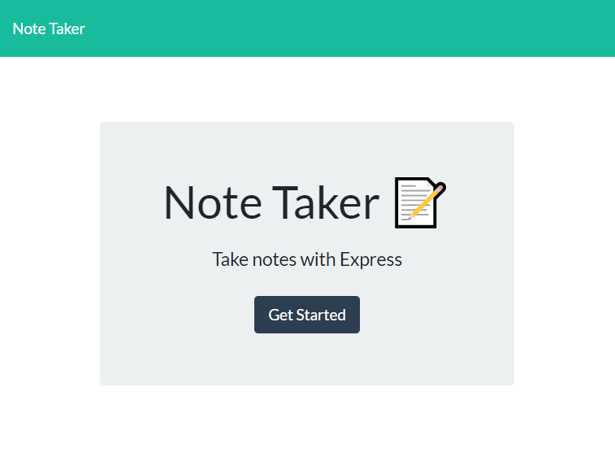
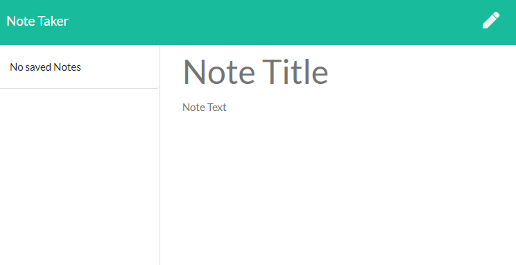
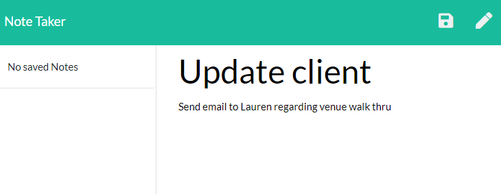
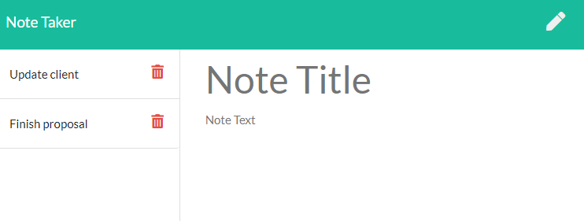

# Organize with Note Taker

## Description

This application helps users that need to keep track of a lot of information. It's easy to forget details or be unable to recall something important. Being able to take persistent notes allows users to have written information available when needed.

```
AS A user, I want to be able to write and save notes
I WANT to be able to delete notes I've written before
SO THAT I can organize my thoughts and keep track of tasks I need to complete
```

## Table of Contents

* [Installation](#Installation)
* [Usage](#Usage)
* [Credits](#Credits)
* [License](#License)
* [Contributing](#Contributing)
* [Test](#Test)
* [Questions](#Questions)

## Installation

IF USING THE HEROKU LINK, you do not have to install anything! Just use the application as shown. 

To use this application from GitHub, please first do a npm install in your command line:

```bash
npm install
```

## Usage

IF USING THE HEROKU LINK, you do not have to install anything! Just use the application as shown. 

To use this application from GitHub, first fork and open the repo onto your local machine. Before attempting to use the app, open your terminal and perform a ```npm install``` to get the necessary packages.

Next, type ```node server.js``` into your integrated terminal or command line. This will start the local host server. You will then be able to open ```index.html``` to begin the application and create notes. 



Next, click on the "Get Started" button to start taking notes. This is what you will first see:



Now you can start adding notes! Give your note a title and some descriptive text, then select the save button in the top right corner.



Anything you add will be saved into the box on the left side of the screen. You can now view your notes by clicking on the title, or delete them by clicking the trash icon. 




## Credits

Alyson Bennett was the sole collaborator on this project. 

## License

[](https://lbesson.mit-license.org/)

[MIT](https://choosealicense.com/licenses/mit/)

Copyright (c) 2020 Alyson Bennett

## Contributing

Pull requests are welcome. For major changes, please open an issue first to discuss what you would like to change.

[](code_of_conduct.md)

## Test

There has not been a test script written for this application yet.

## Questions

If you have any questions, please contact [Alyson Bennett](https://github.com/alysonbennett) at alysonbennett@gmail.com.

